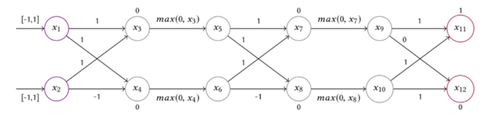

# CS253 HW17
## 1
$x_5$:$(x_5\geq x_3, x_5\leq 0.5*x_3+1, l_5=-2, u_5=2)$
$x_6$:$(x_6\geq x_4, x_6\leq 0.5*x_4+1, l_6=-2, u_6=2)$

## 2
Following is the abstraction, and we can get that

$x_7$:$(x_7\geq x_5+x_6, x_7\leq x_5+x_6, l_7=-2, u_7=3)$
$x_8$:$(x_8\geq x_5-x_6, x_8\leq x_5-x_6, l_8=-2, u_8=1)$
$x_9$:$(x_9\geq x_7, x_9\leq 0.5*x_7+1, l_9=-2, u_9=2.5)$
$x_{10}$:$(x_{10}\geq x_8, x_{10}\leq 0.5*x_8+1, l_{10}=-2, u_{10}=1.5)$
$x_{11}$:$(x_{11}\geq x_9+x_{10}, x_{11}\leq x_9+x_{10}, l_{11}=-4, u_{11}=4)$
$x_{12}$:$(x_{12}\geq x_{10}, x_{12}\leq x_{10}, l_{12}=-2, u_{12}=1.5)$
Thus, $x_{11}- x_{12}\geq x_9+x_{10}-x_{10}=x_9=-2$
So, output is always 1.